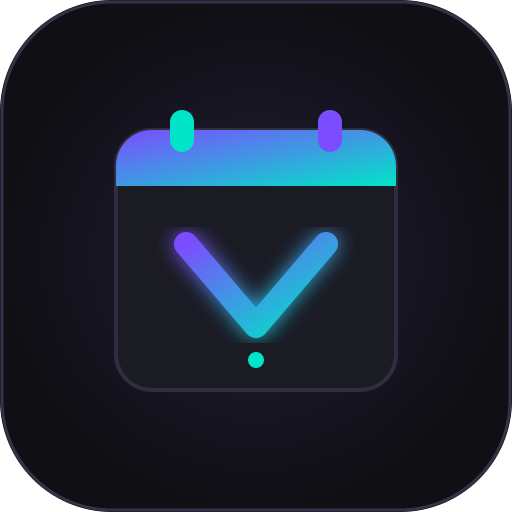

# 🌙 Vexono — تقویم هوشمند شمسی با نمایش میلادی

<p align="center">
  
</p>

<p align="center">
  <strong>یک اپلیکیشن بومی، سریع، مدرن و آفلاین برای مدیریت زمان، تقویم شمسی، میلادی و قمری</strong>
  <br />
  Native Android • 100% Kotlin • Jetpack Compose • Material 3 • Clean Architecture
</p>

<p align="center">
  <a href="LICENSE"></a>
  <a href="https://kotlinlang.org"></a>
  <a href="https://developer.android.com/jetpack/compose"></a>
  
  
</p>

---

## 📑 فهرست مطالب
- [معرفی و ویژگی‌های برجسته](#-معرفی-و-ویژگیهای-برجسته)
- [طراحی و تجربه کاربری (UI/UX)](#-طراحی-و-تجربه-کاربری-uiux)
- [دیتابیس مناسبت‌ها و تعطیلات ۱۰ ساله](#-دیتابیس-مناسبتها-و-تعطیلات-۱۰-ساله)
- [معماری نرم‌افزار (Clean Architecture)](#-معماری-نرم‌افزار-clean-architecture)
- [ویجت صفحه اصلی (AppWidget)](#-ویجت-صفحه-اصلی-appwidget)
- [نحوه بیلد و اجرای پروژه](#-نحوه-بیلد-و-اجرای-پروژه)
- [مشارکت در پروژه](#-مشارکت-در-پروژه)
- [لایسنس](#-لایسنس)

---

## ✨ معرفی و ویژگی‌های برجسته

**Vexono** یک اپلیکیشن تقویم پیشرفته برای اندروید است که برای کاربران فارسی‌زبان طراحی شده تا تقویم شمسی (جلالی) را به صورت بزرگ و اصلی همراه با نمایش ظریف تقویم میلادی و قمری در یک رابط کاربری چشم‌نواز تجربه کنند.

### 🌟 ویژگی‌های کلیدی:
1. **تقویم سه‌گانه دقیق و آفلاین:**
   - نمایش اصلی روزهای شمسی به همراه معادل میلادی در هر خانه تقویم.
   - نمایش تاریخ هجری قمری در جزئیات روز.
   - الگوریتم دقیق ریاضی خیام-بیرشک/بورکوفسکی بدون کوچکترین خطا در سال‌های کبیسه.
2. **پایگاه داده مناسبت‌های ۱۰ ساله (۱۳۹۴ تا ۱۴۰۶+):**
   - دارای دیتابیس کامل تعطیلات رسمی، اعیاد مذهبی و مناسبت‌های ملی و باستانی ایران.
   - قابلیت جابه‌جایی بین سال‌های مختلف و جستجوی لحظه‌ای مناسبت‌ها.
3. **مدیریت رویدادها و یادآورها:**
   - ثبت رویداد با تاریخ شمسی، ساعت، برچسب رنگی و تکرار (روزانه، هفتگی، ماهانه، سالانه).
   - یادآوری دقیق با استفاده از `WorkManager` و کانال اعلان‌های سفارشی.
4. **چک‌لیست تسک‌های روزانه (To-Do):**
   - مدیریت وظایف روزمره، اولویت‌بندی (پایین، متوسط، بالا) و فیلتر کارهای انجام‌شده.
5. **شخصی‌سازی گسترده:**
   - پشتیبانی از تم تاریک نئونی اختصاصی (`#0F0F14`)، تم روشن و حالت سازگار با سیستم.
   - انتخاب رنگ اصلی برند (بنفش، فیروزه‌ای، زمردی، طلایی، رز و نیلی).
   - سوییچ فعال/غیرفعال‌سازی نمایش تاریخ‌های میلادی و قمری.
6. **ویجت اختصاصی صفحه اصلی:**
   - نمایش تاریخ روز شمسی به همراه میلادی و مناسبت جاری روی هوم‌اسکرین.

---

## 🎨 طراحی و تجربه کاربری (UI/UX)

- **رنگ‌بندی نئونی تاریک (Dark First):** پس‌زمینه `#0F0F14` با کارت‌های لایه‌ای `#1B1B24`، رنگ اصلی بنفش نئونی (`#7C4DFF`) و هایلایت‌های فیروزه‌ای (`#00E5C7`).
- **هایلایت تعطیلات:** نمایش شفاف جمعه‌ها و تعطیلات رسمی با رنگ هشدار (`#FF5C7A`).
- **تایپوگرافی فارسی:** اعداد خوانای فارسی و چیدمان استاندارد راست به چپ (RTL).
- **انیمیشن‌های نرم:** جابه‌جایی ماه‌ها با جسچر کشیدن (Swipe) و ترنزیشن‌های `AnimatedContent`.

---

## 📅 دیتابیس مناسبت‌ها و تعطیلات ۱۰ ساله

تمام مناسبت‌های سال‌های **۱۳۹۴ تا ۱۴۰۶ شمسی** بر اساس تقویم رسمی ایران در قالب فایل `occasions_data.json` به همراه اپلیکیشن ارائه شده است:
- مناسبت‌های خورشیدی ثابت (نوروز، سیزده‌بدر، خلیج فارس، یلدا، ۲۲ بهمن و ...).
- مناسبت‌های متغیر قمری که به دقت برای تک‌تک سال‌ها به تاریخ شمسی نگاشت شده‌اند (عید فطر، قربان، غدیر، عاشورا، تاسوعا، مبعث و ...).
- این اطلاعات به صورت ۱۰۰٪ آفلاین در پایگاه داده Room بارگذاری می‌شوند.

---

## 🏗 معماری نرم‌افزار (Clean Architecture)

پروژه به صورت ماژولار و سه‌لایه‌ای بر اساس اصول **Clean Architecture** و الگوی **MVVM** توسعه داده شده است:

```
com.vexono.app/
├── data/
│   ├── calendar/          # الگوریتم محاسبات ریاضی تقویم و تبدیل تاریخ‌ها
│   ├── local/             # پایگاه داده Room (Entities, DAOs, Database)
│   ├── datastore/         # مدیریت ترجیحات کاربر با Jetpack DataStore
│   ├── notification/      # مدیریت آلارم‌ها، نوتیفیکیشن‌ها و WorkManager
│   ├── repository/        # پیاده‌سازی اینترفیس‌های لایه دامنه
│   └── widget/            # پرووایدر و لایوت ویجت اندروید
├── domain/
│   ├── model/             # مدل‌های پایه (JalaliDate, Event, Task, Occasion)
│   ├── repository/        # اینترفیس‌های ریپازیتوری
│   └── usecase/           # موارد کاربرد تقویم، رویدادها، تسک‌ها و تنظیمات
├── presentation/
│   ├── components/        # کامپوننت‌های مشترک واسط کاربری (Picker, Badges, Cell)
│   ├── navigation/        # ساختار مسیریابی Navigation Compose
│   ├── screens/           # صفحات اپ (Splash, Calendar, DayDetail, EventEditor, Tasks, Occasions, Settings)
│   ├── theme/             # پالت رنگ، تایپوگرافی و تم Material 3
│   └── viewmodel/         # ویومدل‌های متصل به Flow و StateFlow
└── di/                    # تزریق وابستگی‌ها (AppContainer)
```

---

## 📱 ویجت صفحه اصلی (AppWidget)

ویجت اختصاصی Vexono با ابعاد استاندارد ۲×۲ اطلاعات تاریخ جاری را با یک نگاه در اختیار کاربر می‌گذارد:
- عدد بزرگ و خوانای روز شمسی به همراه نام ماه و سال.
- نام روز هفته (مثلاً چهارشنبه) با رنگ فیروزه‌ای.
- تاریخ کامل میلادی به صورت ظریف در پایین ویجت.
- عنوان مناسبت یا تعطیلی رسمی روز جاری (در صورت وجود).

---

## 🚀 نحوه بیلد و اجرای پروژه

### پیش‌نیازها:
- **Android Studio Ladybug / Koala** یا جدیدتر
- **JDK 17** (OpenJDK یا Temurin)
- **Android SDK** نسخه ۳۵

### مراحل اجرا:
```bash
# ۱. کلون کردن ریپازیتوری
git clone https://github.com/vexono/vexono-android.git
cd vexono-android

# ۲. اجرای تست‌های واحد
./gradlew test

# ۳. بیلد نسخه Debug
./gradlew assembleDebug

# ۴. نصب روی شبیه‌ساز یا گوشی متصل
./gradlew installDebug
```

---

## 🤝 مشارکت در پروژه (Contributing)

ما از هرگونه مشارکت، گزارش باگ یا پیشنهاد قابلیت‌های جدید استقبال می‌کنیم! لطفاً قبل از ارسال Pull Request فایل [CONTRIBUTING.md](CONTRIBUTING.md) را مطالعه فرمایید.

---

## 📜 لایسنس

این پروژه تحت لایسنس **[MIT License](LICENSE)** منتشر شده است. استفاده، بازنشر و تغییرات در کد برای اهداف تجاری و شخصی آزاد است.
